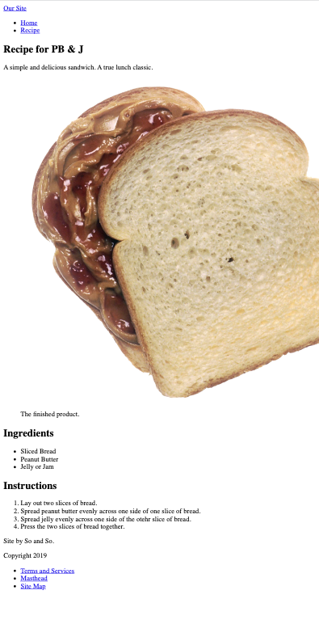

# Basic HTML Text Elements

In this exercise you will learn to create a basic HTML website with HTML elements.

## Exercise

In this exercise you will learn to use the following HTML tags: `<html>`, `<head>`, `<meta charset>`, `<title>`, `<body>`, `<header>`, `<nav>`, `<ul>`, `<li>`, `<main>`, `<article>`, `<section>`, `<footer>`, `<figure>`, `<figcaption>`, ``, `<ol>`, `<p>`, `<h1>`, `<h2>` and `<a>` to build a web page.<br>

Next open the **index.html** from the repository that you downloaded above. Remember that all relevant HTML tags needed to solve this exercise is specified above and all images are placed in the img folder.

## Installation

Download/clone this repo to your machine (Mac / Win).
Next open the **index.html** file from the repository that you downloaded above with your editor Visual Studio Code. Now try to see if you can build a web page similar to the image below.



## HTML tags

**Remember when you build a website you must always start with `<!DOCTYPE html>` on the first line.**

### Headings

Headings are used as section titles in an HTML document. In general, they should describe the content that follows. There are six levels of headings (h1 - h6) and they can be used hierarchically to create multiple levels sub-sections within the content. Headings are block elements by default

```html
<h1>Biggest heading</h1>
...
<h6>Smallest heading</h6>
```

### Paragraphs

Paragraphs (the p tag) are used for blocks of text (just like in writing). Paragraphs are block elements by default.

```html
<p>This is a paragraph HTML tag used for block of text</p>
```

### Strong

strong is an inline element used to add importance to text. By default and most commonly, it makes the text bold.

```html
My name is <strong>Joe</strong>
```

### Article

Article
The article element signifies content that could stand alone as a document. A good way to think of it is to ask yourself if the content would make sense if you shared it with someone who didn't know what website it came from. Examples of content that might use an article element are articles (go figure), blog posts, reviews, essays, user-submitted comments, etcetera.

Because an article acts as an independent unit of content, it may contain most of the other semantic elements, such as header, footer, section, aside, and nav. It could also contain nested articles, such as when the article element is used for post comments.

```html
<article>
  <h2>Google Chrome</h2>
  <p>Chrome is the world's most popular web browser today!</p>
</article>
```

### Section

The section element is the most nonspecific of the semantic elements and represents a thematically-related section of a page, application, or article. It should be used only in instances where other semantic elements don’t make sense. Example uses might include, a chapter or subsection of an article or a distinct functional area of a page.
The section element should always have a natural heading demarcating its content.

```html
<section>
  <h2>WWF History</h2>
  <p>
    The World Wide Fund for Nature (WWF) is an international organization. WWF
    was founded in 1961.
  </p>
</section>
```

### Main

The main element represents the primary content of a page. As such, it should only be used once per page. This is the defacto target for screen-reader users who wish to skip the sort of introductory content and navigation that might, for instance, be found in the header of a page.

```html
<main>
  <h1>Most Popular Browsers</h1>
  <p>Chrome, Firefox, and Edge are the most used browsers today.</p>

  <article>
    <h2>Google Chrome</h2>
    <p>Google Chrome is a web browser developed by Google, released in 2008.</p>
  </article>
</main>
```

### Unordered list & list item

An unordered list starts with the `<ul>` tag. Each list item starts with the `<li>` tag.
The list items will be marked with bullets (small black circles) by default.

```html
<ul>
  <li>Coffee</li>
  <li>Tea</li>
  <li>Milk</li>
</ul>
```

### Header

Not to be confused with head or headings (h1, h2, etc.), the header element should be used to contain introductory content for a page or article. It might contain things such as the title, a tagline, authorship information, etcetera.

```html
<header>
  <nav>
    <ul>
      <li>Contact</li>
      <li>Services</li>
      <li>About Me</li>
    </ul>
  </nav>
</header>
```

You may use more than one header per page. For instance, you may want a header for the page itself, and an additional header for an article contained on the page.

### Nav

The nav element is relatively straightforward and should be used for sets of links that represent major navigation for a site or page. Examples might include primary site navigation, pagination links, a table of contents, or breadcrumb navigation. Nav is not typically used for lists or articles or posts.

```html
<nav>
  <ul>
    <li>Contact</li>
    <li>Services</li>
    <li>About Me</li>
  </ul>
</nav>
```

### Figure & Figcaption

The figure element is used to contain a useful image, illustration, diagram, code snippet, et cetera, that helps to explain the content in the text.

```html
<figure>
  
  <figcaption>Fig.1 - Trulli, Puglia, Italy.</figcaption>
</figure>
```

### Footer

The footer element should be used to contain content about the creator or creation of a page or article. It might contain things such as publication date, authorship information, links to related content, etcetera.

Similar to the header element, you may use more than one footer per page. For instance, you may want a footer for the page itself, and an additional header for an article contained on the page.

```html
<footer>
  <p>Author: Hege Refsnes</p>
  <p><a href="mailto:hege@example.com">hege@example.com</a></p>
</footer>
```

### Img

The img tag is used to embed an image in an HTML page.

Images are not technically inserted into a web page; images are linked to web pages. The `` tag creates a holding space for the referenced image.

The img tag has two required attributes:

- **src** - Specifies the path to the image

- **alt** - Specifies an alternate text for the image, if the image for some reason cannot be displayed

```html

```

## Here is an overview of the most popular HTML5 tags from WebsiteSetup.org


When you finally finish building a website identical to the image below, get into small groups (3-4 people) and identify which HTML tags from this exercise are block elements and which are inline elements.

## Final Result


